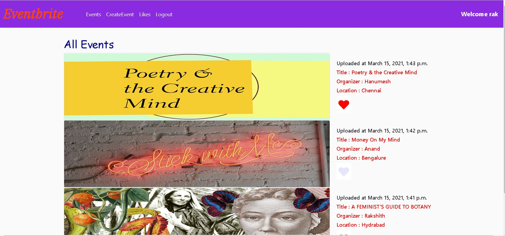
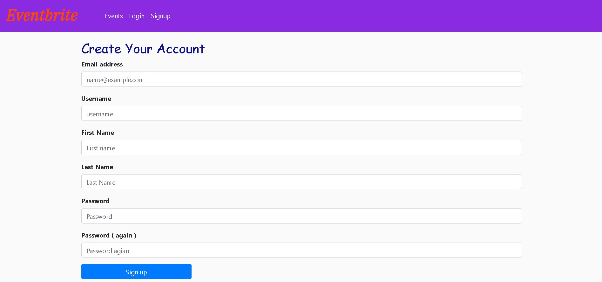
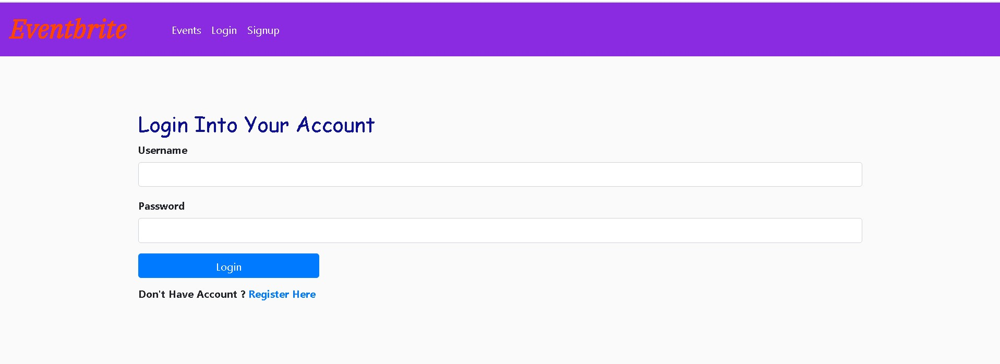
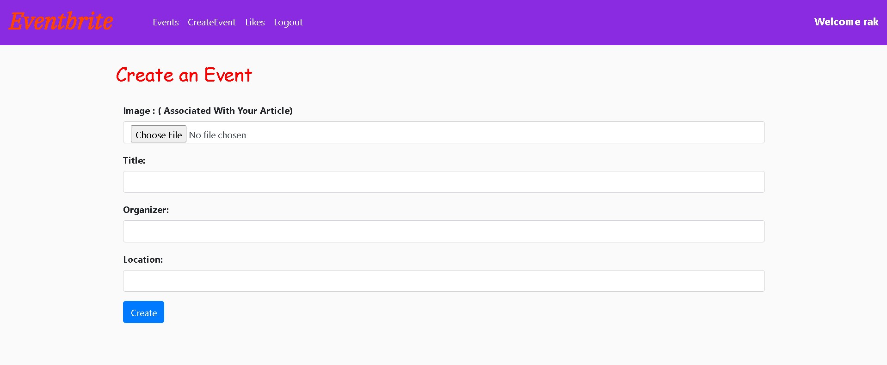
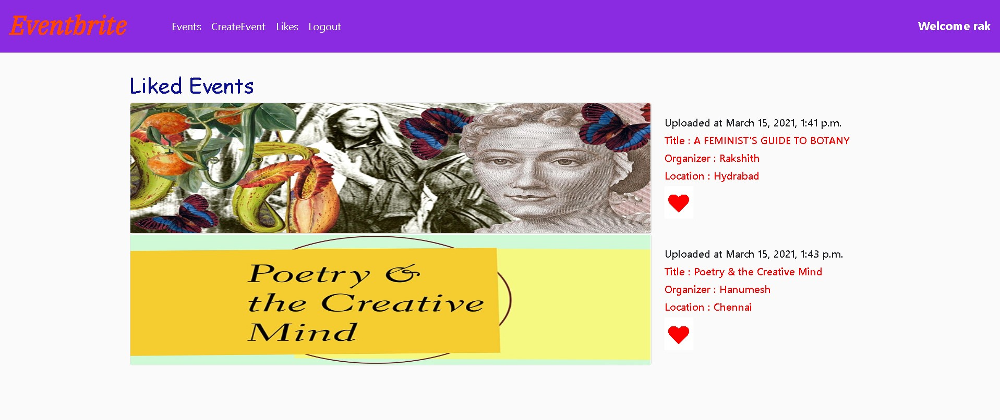

# Event-Assignment
Sir actually i have some issue in my system so am managed to complete this work in my brother laptop so , this work is done in sqlite3 database only because it is in buil in pytcharm.
Am sorry sir but deadline coming near soo thats wyh completed without using mysql database.

# Home Page

# Signup Page

# Login Page

# Create Event Page

# My Liked Event Page

# When Click a Like Button Without Logged in Page

